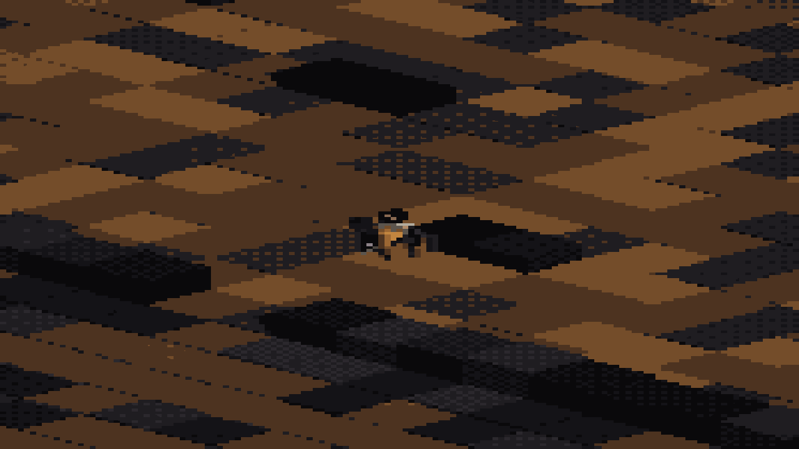

# Regnum Confractum

A persistent-world roleplaying MMO in the tradition of [Arelith](https://arelith.com) —
a small, dense, long-lived world where the point is character, politics and deception,
rather than level grinding.

Gritty low fantasy in a decayed empire. Civilisation has contracted to defensible
pockets; the roads between them are not safe. Isometric, browser-delivered, no install.

**Target scale: 300 concurrent players.** Not 300,000. The most successful world of this
kind peaks around 100–200, and the binding constraint has never been hardware.

---

## Status

**M0 — foundation and harness: built and green.** Authoritative 10Hz server,
shared wire protocol, Postgres persistence with a trigger-enforced append-only
event log, and a headless bot harness that proves the invariants — no item
duplication, no coin creation, no desync, and positions/inventories surviving a
full server restart.

**M1 — the renderer: built.** Browser client with procedural characters generated
from each character's appearance seed, palette-quantised isometric rendering, and
real-time movement between browsers. Art direction awaits stakeholder ratification
(D-406).

**M2 — the roleplay core: mechanically complete.** Nobody has a name until they
give one. Strangers appear as descriptions; a spoken name — true or false —
propagates to everyone in earshot and is silently contested by each listener's
Insight, which is graded, fallible, and never reveals the truth. Emotes animate
from asterisk text ("*doesn't flinch*" correctly does nothing). Unknown tongues
arrive scrambled — the real words never leave the server. Letters are physical,
authorless items: forgery is native. Raise a hood and you are a stranger again;
lower it in view and the watcher's two memories of you merge into one. What
remains of M2 is the human test: two writers, one tavern, ninety minutes.

**M3 — scripting and the DM toolset: built.** The world is a graph — walk off the
tavern street and you are in the Broken Yard. Areas run sandboxed Lua behind a
controlled API; the Ferryman has a scripted keeper. A DM spawns NPCs, speaks
through them (same earshot/sight/language rules as everyone else), narrates, and
changes the light — and builds **events** in a form editor: chained stages that
wait for a trigger (a game hour, a crowd, a death) and fire consequences,
including spawning whole temporary areas linked into the world. Rehearse it,
run it, roll it all back. Death triggers arm today and fire when M4 brings death.

See [`docs/DEV.md`](docs/DEV.md) to run it. The renderer approach was validated by
a working prototype rather than adopted on argument — see `prototypes/`.

See [`docs/BUILD_PLAN.md`](docs/BUILD_PLAN.md) for the milestone map.

---

## Start here

| Document | What it is |
|---|---|
| [`CLAUDE.md`](CLAUDE.md) | Context for Claude Code sessions. Invariants, stack, testing doctrine. **Read first.** |
| [`docs/DECISIONS.md`](docs/DECISIONS.md) | Architecture decision record — 48 decisions with rationale across four design phases. |
| [`docs/BUILD_PLAN.md`](docs/BUILD_PLAN.md) | Milestones, definitions of done, and the first playable slice. |
| [`docs/ASSET_PIPELINE.md`](docs/ASSET_PIPELINE.md) | *Superseded by D-401.* Retained as record. |
| [`docs/ART_SOURCING.md`](docs/ART_SOURCING.md) | *Superseded by D-401.* Market survey, retained as fallback research. |

---

## The design in one page

**Roleplay is the product.** Nobody has a name until they are introduced — you see "a
tall woman in a travel-stained cloak" until she tells you otherwise, and what she tells
you may be a lie. Recognition tracks *observed identities*, not people, so a hooded
figure and the man beneath the hood are separate threads in your memory until something
merges them. Deception is a skill contest, and Insight tells you only that something
rings false, never what the truth is.

**The world does not reward virtue.** There is no alignment meter and no karma bonus. A
player can be good here, and doing so is a costly choice made against the grain — mercy
is always *possible* and never *optimal*. Validation comes from other players, never
from the system.

**Conflict has structure.** In settled areas, hostility must be declared and spoken
aloud, with ten seconds before a blow can land — space for roleplay, or for running. The
wilderness is open. Some endgame places are permadeath unless someone reaches you in
time.

**Death is not an ending.** You become a ghost who can see only other ghosts. A
necromancer may raise your corpse — and you may stay inside it and watch, speaking in a
garbled undead register. Speak With Dead grants five questions, and the dead are under
no obligation to answer honestly.

**Settlements hide.** Factions found towns whose coordinates exist as a physical item — a
map that can be stolen, forged or sold. Revealing your location invites trade, and
bandits. That choice is the world's central tension.

**Nothing is wasted.** Every item is a base material, equipment, a consumable, a
valuable, or an input to something better. A CI validator fails the build on orphans.

---

## Technical shape

- **TypeScript** across server and client, with the wire protocol defined once in a
  shared package
- **Authoritative server** at 10Hz, tile-based movement, non-twitch combat
- **Postgres** as source of truth, with an append-only event log from day one
- **Three.js client** — procedural characters generated from a seed, procedural
  animation, verlet cloth, rendered at low internal resolution and palette-quantised
- **Sandboxed Lua** for world content and DM-authored events
- **One VPS**, Docker Compose. No Kubernetes.

Characters are built from rules rather than assets: no meshes, no keyframes, no sprite
sheets. The whole renderer prototype, including a bundled copy of Three.js, is 540KB.

---

## Prototypes

`prototypes/procedural-characters.html` — open it in a browser. Every character is
generated from an integer seed; the emotes are procedural poses; capes and hair are
verlet chains solved per frame. Hit **Regenerate** to see the argument.

`prototypes/procgen.src.html` is the unbundled source. `prototypes/build.mjs` bundles it.

---

## Licence

Not yet chosen. No Wizards of the Coast product identity is used anywhere in this
project — see D-209.
